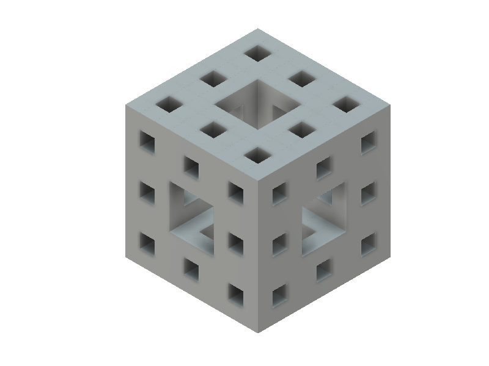
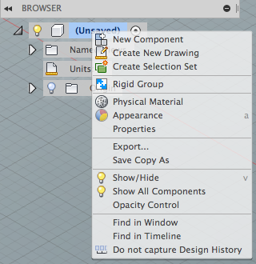
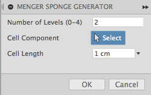
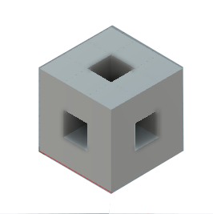

# Fusion360MengerSponge

This script is used for generating Menger Sponges in [Autodesk Fusion 360](http://fusion360.autodesk.com/).

Level 2 (9x9x9) Menger Sponge

## Installation

Copy the "Fusion360MengerSponge" folder into your Fusion 360 "My Scripts" folder. You may find this folder using the following steps:

1. Start Fusion 360 and then select the File -> "Scripts and Add-Ins..." menu item
2. The Scripts and Add-Ins dialog will appear and display the "My Scripts" and "Sample Scripts" folders
3. Select one of the "My Scripts" files and then click on the "+" Details icon near the bottom of the dialog.
  - If there are no files in the "My Scripts" folder then create a default one by clicking the Create button, select JavaScript, and then OK.
4. With a user script selected and the "Details" section expanded, look at the Full Path value.  This contains the location of the user scripts folder.
5. Copy this script's folder into that location.
  For example, on my Mac the folder is located in:
    /Users/USERNAME/Library/Application Support/Autodesk/Autodesk Fusion 360/API/Scripts
  And on Windows:
    C:\users\USERNAME\AppData\Roaming\Autodesk\Autodesk Fusion 360\API\Scripts
6. Now add the script to the lists of "My Scripts"
7. Click the "+" icon next to the "my Scripts" item
  - The "Add new script" dialog should appear.
8. Locate the MengerSponge.js file in the folder you copied, select it, and click Open. The script should now be installed and ready to be run.

The script should be ready to run.

## Performance (important unless you have hours to wait)

> This script will create many bodies and the operations to do so will be recorded in the design history.  It's recommended that the "Capture Design History" option be turned off:
> 
> 
>
> The implementation is also in JavaScript which incurs an additional overhead.  A Python implementation is in the plan...

## Usage

1. Run the "MengerSponge" script from the Script Manager
2. The settings dialog will be shown.  Adjust to your preferences:

  

  - Levels: Number of levels to generate.
  - Cell Component: If selected, clone this component for each of the cells.
  - Cell Length: The size of each cell.
3. Click OK to generate the model

## Issues

- Fusion 360 isn't happy about very large levels and will lock up.  See the "Performance" section above.

Level 1 (3x3x3) Menger Sponge
